<!-- Animated Name Title -->

  

<!-- Tagline & Badge Row -->

  <strong>🌌 Space-Tech Enthusiast | Full-Stack Developer | Systems &amp; Network Engineer</strong>

  
  
  

### 🛰️ Orbit Telemetry &amp; Profile Summary

I am a passionate systems architect and software developer. My engineering focuses on building high-performance, real-time communication systems, secure zero-trust network configurations, and interactive 3D renderings of astronomical datasets.

🏆 **NASA Space Apps Challenge Gold Medalist** for creating **NeoVision**, a web platform implementing Keplerian orbital mechanics.

---

<!-- Banner + Skills Side-by-side -->
<table align="center" style="width:100%; max-width:1200px; border:none; background:transparent;">
  <tr>
    <td style="width:50%; padding:8px; vertical-align:top; text-align:center;">
      
    </td>
    <td style="width:50%; padding:8px; vertical-align:center; text-align:center;">
      <!-- <h2>💻 Skills Console</h2>
      
Below is the live simulated terminal loading system modules, configuring zero-trust tunnels, and listing my technical competencies:
 -->
      
    </td>
  </tr>
</table>

---

## 🛠️ Tech Stack

Here are the technologies I leverage to build scalable software and network topologies:

<table align="center" style="border: none; background: transparent;">
  <tr>
    <td align="center" valign="top" width="20%">
      <strong>Languages</strong>  
      &nbsp;
      &nbsp;
      &nbsp;
        
      &nbsp;
      
    </td>
    <td align="center" valign="top" width="20%">
      <strong>Frontend</strong>  
      &nbsp;
      &nbsp;
        
      &nbsp;
      
    </td>
    <td align="center" valign="top" width="20%">
      <strong>Backend</strong>  
      &nbsp;
      &nbsp;
      &nbsp;
        
      &nbsp;
      
    </td>
    <td align="center" valign="top" width="20%">
      <strong>Databases</strong>  
      &nbsp;
      &nbsp;
      
    </td>
    <td align="center" valign="top" width="20%">
      <strong>Infra &amp; Tools</strong>  
      &nbsp;
      &nbsp;
      &nbsp;
        
      &nbsp;
      
    </td>
  </tr>
</table>

---

## 🚀 Featured Projects

### 🌌 [NeoVision](https://github.com/SrikarSriramoju/NeoVision)

- **NASA Space Apps Challenge Gold Medalist** 🥇
- An interactive 3D solar system visualization engine mapping Near-Earth Objects (NEOs) using real-time NASA open datasets.
- Powered by **React.js**, **Three.js**, **Node.js**, and **MongoDB** with custom-built orbital mechanics calculations.

### 🌐 [SecureVC &amp; Private Cloud](https://github.com/SrikarSriramoju)

- A zero-trust, peer-to-peer audio/video streaming server utilizing **WebRTC** and encrypted **Tailscale mesh networking**.
- Host-secure, self-configured private cloud with **Raspberry Pi NAS** storage and public-port-bypass via Tailscale Funnel.

### 💸 [InnovateFund](https://github.com/SrikarSriramoju/InnovateFund)

- **CodeRush Hackathon Best Innovation Award** 🏆
- A real-time crowdfunding and investor networking web application.
- Designed using the **MERN Stack** with persistent **Socket.IO** socket updates for notifications, discussions, and role-based funding access.

### 🗳️ [FRVS - Feature Request and Voting System](https://github.com/SrikarSriramoju/FRVS)

- A scalable feedback management platform built with **Spring Boot** and **Java** targeting enterprise enhancement pipelines.
- Includes micro-optimized **MySQL** schemas for high-speed vote aggregation and JWT role verification.

### 🎓 [One Stop Career Guidance](https://github.com/SrikarSriramoju/One_stop_career_guidan)

- A counseling platform mapping career paths and recommendations for students and fresh grads.

---

## 📊 GitHub Contribution Metrics &amp; Graphs

Here are my development metrics and active commit analytics:

<!-- GitHub Weekly Commit Activity Graph -->

  

  

  

---

  🪐 <em>"Configuring network meshes across celestial realms..."</em>

